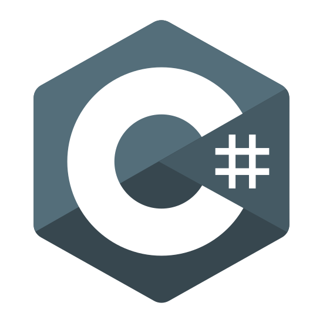

<!-- List Of Websites-->
[blog]: https://npchitman.com
[Aphrodite]: https://github.com/npchitman/Aphrodite
[outlook]: mailto:npchitman@outlook.com
[reddit]: https://www.reddit.com/user/npchitman
[github]: https://www.github.com/npchitman
[gmail]: mailto:npchitmann@gmail.com

### <ins>About Me:</ins>

- Interested in computer graphics and game engine programming
- Currently practising C++, Vulkan, OpenGL and game engine programming
- Currently working on [Aphrodite-Engine][Aphrodite]: 
[][Aphrodite]

***

### <ins>Languages and Tools:</ins>

&nbsp;&nbsp;&nbsp;&nbsp;
&nbsp;&nbsp;&nbsp;&nbsp;
&nbsp;&nbsp;&nbsp;&nbsp;
&nbsp;&nbsp;&nbsp;&nbsp;
&nbsp;&nbsp;&nbsp;&nbsp;
&nbsp;&nbsp;&nbsp;&nbsp;
&nbsp;&nbsp;&nbsp;&nbsp;
&nbsp;&nbsp;&nbsp;&nbsp;

***
